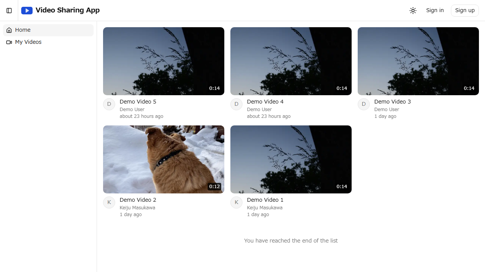
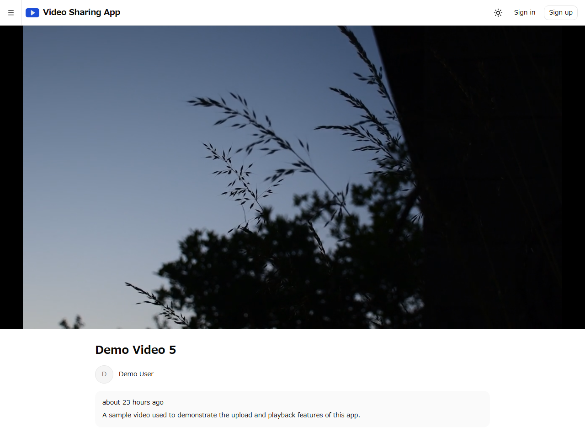
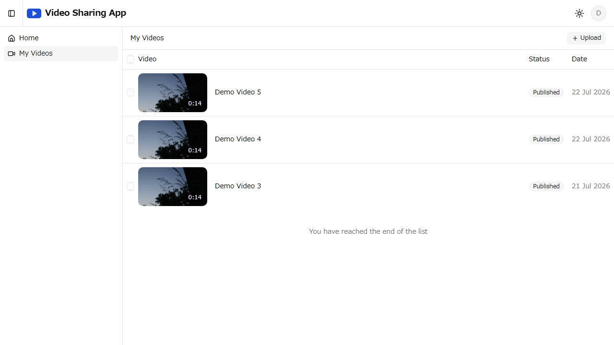
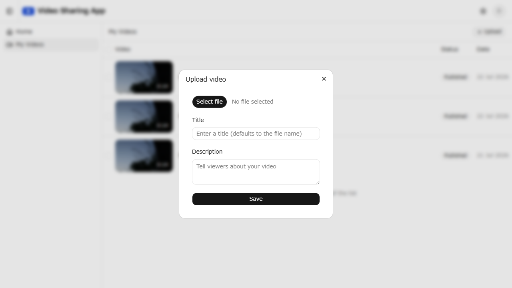

# video-sharing-app

[English](./README.md) | 日本語

<!-- 内容を更新した際は README.md(英語版)も忘れずに同期すること -->

## プロジェクト概要

動画をアップロードして再生できる動画共有アプリ。
ログインして動画を投稿し、一覧から選んで視聴できる。

### デモ

https://video-sharing-app-sand.vercel.app

- 動画の閲覧・再生はサインインなしで利用できる
- サインアップすると動画のアップロード・管理も試せる
- テスト公開のため、投稿されたデータは予告なく削除される場合がある
- 無料プランで運用しているため、アップロード本数には上限があり、一時的に利用できない場合がある

### 主要機能

- 動画一覧・再生
- 動画アップロード
- 動画管理(動画一覧・編集・複数選択削除)
- ユーザー認証(サインアップ / サインイン)

### スクリーンショット

| 動画一覧 | 動画再生 |
| --- | --- |
|  |  |

| 動画管理 | 動画アップロード |
| --- | --- |
|  |  |

## 技術スタック

| 分類 | 技術 | バージョン |
| --- | --- | --- |
| 言語 | TypeScript | 5.x |
| フレームワーク | Next.js(App Router) | 16.x |
| API層 | tRPC(+ TanStack Query) | 11.x |
| 認証・データベース | Supabase(Auth / PostgreSQL) | - |
| ORM | Drizzle ORM | 0.45.x |
| 動画基盤 | Mux(アップロード・エンコード・再生) | - |
| スタイリング | Tailwind CSS | 4.x |
| UIコンポーネント | shadcn/ui | - |
| フォーム | React Hook Form + Zod | 7.x / 4.x |
| 単体・結合テスト | Vitest + Testing Library | 4.x / 16.x |
| E2Eテスト | Playwright | 1.x |
| パッケージ管理 | pnpm | 11.x |
| CI/CD | GitHub Actions | - |
| デプロイ | Vercel | - |

## アーキテクチャ(動画のアップロード・再生)

動画ファイルはブラウザから Mux へ直接アップロードし(Direct Upload)、エンコード後は Mux から HLS でストリーミング再生する。動画のメタデータ(タイトル、Mux の Playback ID 等)は Supabase の PostgreSQL に保存する。Next.js は UI と Route Handler(アップロードURLの発行、Mux Webhook の受信等)を担う。クライアント⇔サーバー間のAPIは tRPC で定義し、型安全に呼び出す。DBアクセスは Drizzle ORM で行い、認可チェックは tRPC のプロシージャで実施する。

```
[ブラウザ] ──動画アップロード (Direct Upload)──→ [Mux]
    │ ←──ストリーミング再生 (HLS)──────────────────┘
    │                                              │
    ├─ 認証 ──────────→ [Supabase Auth]            │ Webhook(エンコード完了等)
    └─ ページ表示・API → [Next.js] ←───────────────┘
                            └─ メタデータ保存/取得 → [Supabase PostgreSQL]
```

## ディレクトリ構成

```
.
├── .github/             # PRテンプレート・CIワークフロー
├── drizzle/             # DBマイグレーションファイル
├── e2e/                 # Playwright E2Eテスト
├── public/              # 静的ファイル
├── src/
│   ├── app/
│   │   ├── page.tsx             # / → /videos へリダイレクト
│   │   ├── (main)/              # メインレイアウト(サイドバー + ヘッダー)
│   │   │   ├── videos/          # 公開動画一覧
│   │   │   └── my-videos/       # 動画管理(認証必須)
│   │   ├── (player)/            # プレイヤーレイアウト
│   │   │   └── videos/[videoId]/  # 動画再生ページ
│   │   ├── auth/callback/       # 認証コールバックエンドポイント(Supabase Auth)
│   │   └── api/
│   │       ├── trpc/[trpc]/     # tRPC エンドポイント(fetch adapter)
│   │       └── webhooks/mux/    # Mux Webhook ハンドラ
│   ├── components/      # 共通コンポーネント
│   │   ├── auth/        # 認証関連
│   │   ├── layout/      # サイドバー・ヘッダー等のレイアウト
│   │   ├── videos/      # 動画関連
│   │   └── ui/          # shadcn/ui 生成コンポーネント
│   ├── constants/       # 定数
│   ├── db/              # Drizzle スキーマ・DB接続
│   ├── hooks/           # 共通フック
│   ├── lib/             # Supabase / Mux クライアント等
│   ├── proxy.ts         # セッション更新・認証リダイレクト(Supabase Auth)
│   ├── trpc/            # tRPC 初期化・ルーター定義・クライアント/サーバー用プロキシ
│   └── types/           # tRPC を経由しない共有型
├── drizzle.config.ts    # Drizzle Kit 設定
├── next.config.ts       # Next.js設定
├── playwright.config.ts # Playwright 設定
├── vitest.config.mts    # Vitest 設定
├── package.json
└── tsconfig.json
```

## セットアップ

必要環境: Node.js 24以上 / pnpm 11以上

```bash
pnpm install   # 依存関係のインストール
pnpm dev       # 開発サーバーの起動
```

環境変数は `.env.local` に設定する。

| 変数名 | 説明 |
| --- | --- |
| `NEXT_PUBLIC_SUPABASE_URL` | Supabase プロジェクトのURL |
| `NEXT_PUBLIC_SUPABASE_PUBLISHABLE_KEY` | Supabase の Publishable key |
| `DATABASE_URL` | Supabase PostgreSQL の接続文字列(Transaction pooler) |
| `MUX_TOKEN_ID` | Mux のアクセストークンID |
| `MUX_TOKEN_SECRET` | Mux のアクセストークンシークレット |
| `MUX_WEBHOOK_SECRET` | Mux の Webhook 署名シークレット |
| `MUX_UPLOAD_CORS_ORIGIN` | アップロードを許可するオリジン(未設定時は `*`。本番では本番URLを設定する) |

## 開発コマンド

すべてリポジトリルートで実行する。

| コマンド | 説明 |
| --- | --- |
| `pnpm dev` | 開発サーバーの起動 |
| `pnpm build` | 本番用ビルド |
| `pnpm test` | 単体・結合テストの実行(Vitest) |
| `pnpm test:e2e` | E2Eテストの実行(Playwright) |
| `pnpm lint` | Lintの実行 |
| `pnpm format` | コードフォーマット |
| `pnpm db:generate` | マイグレーションファイルの生成(Drizzle Kit) |
| `pnpm db:migrate` | マイグレーションの適用 |
| `pnpm db:studio` | Drizzle Studio の起動 |

## 開発サーバーのURL

http://localhost:3000
